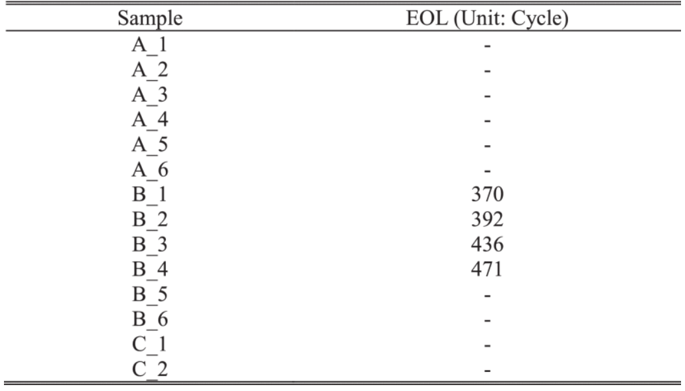

# Title: Reduction of Li-ion Battery Qualification Time Based on Prognostics and Health Management

## Abstract
리튬 이온 배터리(Lithium-ion Battery, LIB)는 휴대용 전자기기부터 전기 자동차에 이르는 다양한 응용분야에 사용되어지고 있다. 반복되는 충방전 동안 SEI(Solid Electrolyte Interphase)의 성장과 같은 전기화학적 반응으로 배터리의 용량이 저하된다. 리튬 이온 배터리는 EOL(End Of Life)에 도달하게되면 사용하지 않는 것이 좋은데, 몇몇 정상상태가 아닌 배터리들은 빠르게 EOL에 도달하게 된다. 배터리의 검증 테스트 내에는 LIB의 신뢰성을 시험하고 정상상태가 아닌 배터리를 분류하는데 이러한 테스트를 수행하는데에는 몇 달의 시간이 걸린다.
따라서 본 논문에서는 EOL에 도달하기 이전 이상(anomaly)를 감지함으로 LIB의 자격(검증) 시험을 단축시키는 데이터 드리븐(data-driven) 방법을 개발하였다. 위 방법은 비정상(Unhealthy) 배터리의 이상을 용량 저하의 곡선을 통해 감지하였고 개발된 방법은 EOL 도달 이전에 배터리의 이상 상태를 확인할 수 있다고 전했다.

## Introduction
LIB는 많은 시스템 및 자산의 전원 공급 장치로 중요한 구성 요소 중 하나이며, 이는 LIB가 다른 배터리와 비교하였을 때 높은 에너지 밀도와 낮은 메모리 효과로 더 높은 용량과 긴 수명 주기를 가지고 있다. 이러한 배터리도 반복적인 충방전에 따른 용량 감소로 인한 문제가 발생할 수 있다. 배터리의 용량 감소는 주로 불안정한 전해질로 인한 SEI의 성장으로 인해 발생한다. 그리고 이러한 SEI의 성장은 LIB에서 불가피하게 발생하는 반응이다. 많은 연구들은 SEI 성장에 따른 용량 감소를 시간 영역에서 제곱근 모델로 적합할 수 있음을 나타냈다.
이러한 LIB의 상태를 정량적으로 나타내는 파라미터를 아래와 같이 정의 할 수 있다.

* SOH(State Of Health): 배터리의 남아있는 정격 용량
* SOC(State Of Capacity): 공칭 용량에 대한 남아있는 배터리의 용량
* SOP(State Of Power): 현재 제공할 수 있는 전력의 능력

  

배터리가 SOH가 특정 임계값 아래로 떨어질 때, 배터리는 EOL에 도달했다고 할 수 있으며 배터리가 전자 제품의 예상 수명보다 빠르게 EOL에 도달할 경우, 해당 배터리는 불량으로 판단된다.

현장에서는 일반적으로 LIB의 신뢰성을 평가하기 위해 가속 수명 주기 테스트(Accelerated Degradation Test, ADT)가 수행된다. 테스트에서는 한 사이클은 충전/방전 단계로 구성되며 이 단계 동안 배터리의 용량이 측정되며 전류 및 충전 속도와 같은 파라미터를 조정함으로 배터리의 용량 감소를 가속화 한다. 테스트 결과를 바탕으로, 회사들은 12개월, 24개월, 1000사이클과 같이 보증 기간을 결정하게 된다. 그런데 배터리의 자격 인증 시험 과정이 오랜 시간 걸리게 되는 문제로 인해 제품 출시 시간이 지연되며 이는 재정적 손실로 이어 질 수 있다. 따라서 LIB의 배터리 자격 인증 시간을 줄이는 방법이 필요하다.

이전까지 개발된 전기화학적 방법과 데이터 드리븐 방법은 LIB의 신뢰성을 평가하는 시간을 단축하였지만, 일반적으로 고장 및 정상상태의 샘플 모두에서 훈련데이터가 필요하였고 또한 고장에 대한 샘플을 분류하기 위해 추가적인 측정 시간이 필요하였다. 이러한 훈련데이터에 대한 추가적인 측정은 자격 검증 테스트 시간을 늘리게 된다.

따라서 본 논문은 LIB의 자격 검증 테스트 시간을 단축하기 위해 용량 저하 곡선의 변곡점을 감지하는 방법을 제안했다.

## Capacity Fade Data
본 논문에서는 두 가지 유형의 LIB의 용량 저하 데이터 세트 A, B, C 를 사용했다. A와 B는 공칭 용량이 3260mAh, LiNMC 기반 배터리이며, C는 공칭 용량이 1500mAh인 LiCoO2 기반 배터리이다. 각 배터리는 다른 조건(Lot)에서 제조되었고, 각 배터리 용량은 최대 500 사이클까지 측정 되었으며, 이는 가속된 조건에서 약 3개월, 사용조건은 1~2년에 해당된다. 그리고 전체 테스는 25°C 에서 수행되었다. 또한 본 논문에서는 SOH가 500 사이클 이전 80% 이하로 떨어지는 배터리로 정의되며 원시 데이터의 SOH 그래프와 각 샘플의 EOL은 Figure. 3과 Table.1 에 요약되어 있다.

> 일반적으로 공칭용량, SOH 80%로 떨어지는 배터리를 고장이라고 한다. 몇몇의 논문들에서 '업계표준'이라고 표현하는데, 출처가 불분명하다. 그러나 그라운드 룰 정도로 생각하면 좋을 것 같다.

  

  

## Methodology
1. **Curvature With a Square-Root Time Domain** 
SEI 성장에 대한 연구에 따르면, 정상 상태의 용량 감소는 시간 도메인에서 제곱급 모델에 의해 적합될 수 있다. 즉, 다른 원인들은 용량 감소를 가속화 하여 용량 감소 곡선에 변곡점을 유발 할 수 있다. 따라서 고장 상태의 용량 저하 곡선은 용량 저하의 변곡점을 관찰함으로써 알 수 있다. 본 논문과 같은 경우(순차적 측정) 변곡점은 임계값이 있는 곡률 값을 사용했다. 또한 용량 저하 곡선의 이상값은 곡률 값으로도 식별할 수 있다.

$$\kappa = \lim_{dl \to 0} \left| \frac{d\theta}{dl} \right|$$
$$\kappa = \frac{|x'y'' - y'x''|}{(x'^2 + y'^2)^{3/2}}$$

  

따라서, SEI 성장은 위 두 제곱근 모델에 적합될수 있고, 이를 위해 본 논문에서는 시간 도메인 데이터는 제곱근 모델에 선형적으로 적합하기 위해 제곱근 시간으로 변횐을 수행했다.
본 연구에서는 측정 잡음의 영향을 줄이기 위해 연속되 5개의 곡률 값 중 3개가 임계값을 초과할 때 이상으토 탐지했다. 또한 임계값은 정상 상태 배터리의 곡률의 평균과 분산을 기반으로 정의되었다.

2. **Performance Comparison** 
본 논문에서는 배터리 PHM에 널리 사용되는 PF(Particle Filter)와 개발된 방법의 비교를 수행하였다.
PF 방법은 일련의 예상되는 EOL 데이터 세트를 이용하여 사후 분포를 근사하기 하여 확률 밀도를 나타내는 방법을 통해 EOL를 추정하는 방법이다.

## Results
개발된 방법의 적용 결과 비정상(고장)상태의 곡률 값은 정상 상태의 곡률값 보다 일찍 증가하는 것을 확인할 수 있었다.

  

  

임계값을 넘어 탐지된 이상치들에 따르면 이상치는 각 샘플에서 감지되었고, 결과는 Table. 2로 요약되어 있다.
모든 비정상 상태의 샘플은 300 사이클에 근접하여 이상치가 나타나고 있는 반면에, 다른 샘플은 400~450 사이클에 가까운 이상치를 가지고 있다. 또한 개발된 방법은 비정상 상태의 배터리를 분류하기 위해 65%~75%의 사이클(375사이클)만 필요했다. PF 방법의 결과는 비정상 상태의 절반만 탐지하거나 모든 배터리가 정상이라고 분류하였고, 본 논문에서 제시한 방법은 테스트 시간을 줄일 수 있는 방면, 기존의 방식은 비정상 상태의 배터리를 정확하게 감지하는 데 많은 시간이 필요했다.

  

## Conclusion
본 논문에서는 LIB의 자격 시험을 단축하는 데이터 드리븐 방법을 개발 하였다. EOL에 도달하기 이전 배터리 용량 저하 값의 곡률 값을 이용하여 배터리의 이상을 탐지하였고, 그 결과로 약 300 사이클 내에 탐지하였고 기존의 가속 수명 주기 테스트는 일반적으로 500 사이클 이상을 필요로 한다. 또한 개발된 방법은 배터리의 용량 저하 데이터만 요구하는 반면에 다른 기계 학습 기반의 방법은 용량 페이드 추세를 훈련하기 위해 다른 샘플의 데이터를 필요로 한다는 차이가 있다.

## Review & Next Step
본 논문을 읽고 LIB 시험을 단축시키는 방법에 대하여 어떤 방식으로 초기 몇 사이클 데이터 내의 배터리의 신뢰성 평가를 수행할 수 있는지에 대한 고찰을 하였다. 본 논문을 읽었을 때, 전체 데이터를 대상으로 곡률을 계산하였다. 그런데 실시간으로 곡률을 탐지하여 고장 배터리 및 배터리 용량 저하의 가속 지점을 알아내어 해당 가속 지점 이후로 부터의 적용할 수 있는 새로운 모델, 즉 곡률 자체를 하나의 파라미터로 설정할 수 있는 모델을 개발할 수 있으면 신뢰성 테스트 시간을 줄일 수 있을 것으로 예상된다. 
추가적으로 배터리의 고장을 탐지하는데 중요한 역할을 하는 임계점에 대해 본 논문에서는 단편적으로 평균과 분산을 이용하여 임계점을 설정했다고 하였는데 위 부분에 대한 설명이 부족하다고 생각된다. 

### 참고 문헌
[1] [Lee, J., Kwon, D., & Pecht, M. G. (2018). Reduction of Li-ion battery qualification time based on prognostics and health management. IEEE Transactions on industrial electronics, 66(9), 7310-7315.](https://ieeexplore.ieee.org/document/8536863)