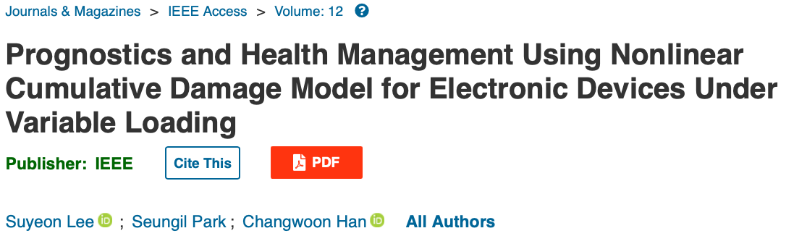
# Title: Prognostics and Health Management Using Nonlinear Cumulative Damage Model for Electronic Devices Under Variable Loading

## Abstract
본 논문에서는 솔더 조인트의 비선형적인 누적 손상에 대해 PHM(Prognostics and Health Management) 적용을 수행했다. 총 변형 에너지 밀도 모델을 포함하여 몇몇의 누적 손상 모델은 마이너의 법칙의 한계를 설명하기위해 조사되었다. SoD(State of Damage)의 개념은 PHM 성능을 평가하기 위해 중추적인 역할로 소개되었다. 그러나 현재 새로운 SoD의 정의는 실시간성의 요구와 함께 선형적이고 지수적으로 급격하게 변화하는 양상의 균형을 맟추기 위해 scale factor를 가진 새로운 정의가 제안되었다. 게다가, SoD 메트릭으로 RUL(Remaining Useflu Life)을 계산함으로써 마이너의 법칙과 총 변형 에너지 밀고 모델으로 부터의 RUL 예측이 scale factor와 함께 비교되었다. 향상된 scale factor와 함께 총 변형 에너지 밀도 모델의 결과가 마이너의 법칙보다 뛰어난 SoD 와 RUL의 예측 정확도를 보였다.
본 논문은 scale factor를 더한 SoD 개념을 소개함으로써 PHM 방법론을 향상시키고, 또한 다중 부하 아래의 전자 시스템의 신뢰성 향상의 잠재력을 보여준다.

## Introduction
전자제품은 현대 생활의 필수적인 부분이며, 특히 미래 모빌리티 산업에서 최근 구동 시스템을 기계에서 전기 및 소프트웨어 기반 시스템으로 변화시키고 있다. 차량과 같은 경우 거친 도로 조건으로 인한 온도 변화와 진동, 즉 온도, 진동, 습도 및 먼지와 같은 다양한 스트레스로부터 노출되어 있으면 이는 차량 고장의 주 원인이다.특히, 사용시간의 증가 및 도로 환경으로 부터 가변 진동에 영향이 가속화 될 것이므로 가변 진동 조건으로 인한 차량 전자 시스템의 고장을 예측하고 예방하는 유지 보수 기술과 응용 방법을 개발하는 것이 중요하다.

PHM은 높은 신뢰성과 안전성을 요구하는 많은 산업에서 현재 운영 상태 시스템의 실시간 health 평가를 용이하게 하고 현재 정보를 기반으로 미래 상태를 예측한다. 그러나 기계 시스템의 PHM에 비해, 전자 시스템을 위한 PHM의 개발은 더 많은 도전에 직면해 있는 상황이다. 이는 주로 전자 시스템의 갑작스럽게 변화하는 데이터 신호의 부재와 같은 독특한 특성 때문이다.

PHM 수행 방법으로 현재까지 제안된 방법은 대표적으로 두 가지 이다.
1. Monitoring Precursor Failure(MPF): 고장 전조 모니터링(;전구체 모니터링)
2. Monitoring Environmental Stress(MES): 환경 스트레스 모니터링

> 본 논문에서 참고 문헌으로 제시한 두 문헌에서는 MPF, MES 이외의 'Canaria'라는 고장 전조 상태에서 주 시스템이 고장나기 이전 부 시스템이 고장하는 방식의 전자 시스템의 PHM 방법론도 제안하고 있다.

MPF는 고장 관련 전자 신호 또는 고장 전조 증상(;전구체, precursor)를 기반으로 수명을 예측하는 방법이며 시스템의 고장을 직접 측정하여 남은 수명을 예측하는 것을 포함한다. 그러나 MPF는 전조 증사(precursor)가 항상 갑작스러운 고장 신호 변화를 나타내는 것은 아니며 또한, 모든 고장 전조 매개변수를 쉽게 측정할 수 있는 것도 아니기 때문에 실용적인 응용에 한계가 있다.

이와 반대로 MES는 구성 요소나 시스템에 물리적 또는 화학적 손상을 일으킬 수 있는 온조, 진동, 습도 및 전압과 같은 환경 스트레스를 모니터링하여 health를 모니터링하고 RUL을 예측하는 것을 목표로 한다. MES는 일정한 환경 스트레스와 S-N 곡선(Stress-Number of cycles to failure)과 같은 구성 요소의 수명 사이의 관계를 확립할 수 있는 수명 예측 모델(Life Prediction Model)을 사용해야한다. 또한 실제 조건 하, 가변 부하 하에서 PHM에 대한 LPM을 구현하려면 누적 손상 모델(Cumulative Damage Model)이 필요하다.

따라서 본 논문의 목적은 가변 하중 조건 하에서 전자 제품에 대한 PHM의 예측 정확도를 향상시키기 위해 CDM을 발전 시킴으로써 MES 방법을 개선하는 것이다. MES의 대표적인 CDM인 마이너의 규칙은 PHM을 구현하는 효과적으로 인정받고 있으나, 예측에서 부하 수준과 부하 시퀸스의 독립성과 같은 한계가 부정확성을 초래한다고 알려져 있다. 이러한 문제를 해결하기 위해 본 논문은 CDM과 모델의 정의된 '손상(damage)'를 재검토하여 PHM 프레임워크에서 효과적으로 구현되고 RUL을 예측할 수 있는 CDM의 '손상'에 대한 새로운 정의를 수행하였다.

> Miner's rule 
피로 손상 누적에 대한 경험적인 이론으로 다양한 응력 수준에서 반복적인 하중을 받는 재료의 피로 수명을 추정하는데 사용됨.  
$D = \sum(n_i/N_i)$ 
$(\space D: 누적 손상,\space n_i: 실제 응력 수준에서 발생한 사이클 수, \space N_i: 해당 응력 수준에서 재료가 실패하기 전 까지 견딜 수 있는 사이클 수)$

## Selection of CDM
Minor의 법칙이 개괄된 이후 다양한 논문에서 검토되었지만, 해당 법칙의 한계 및 문제는 여전히 존재하기에 이를 해결하기 위해 다양한 CDM이 연구되고 개발되었다.

  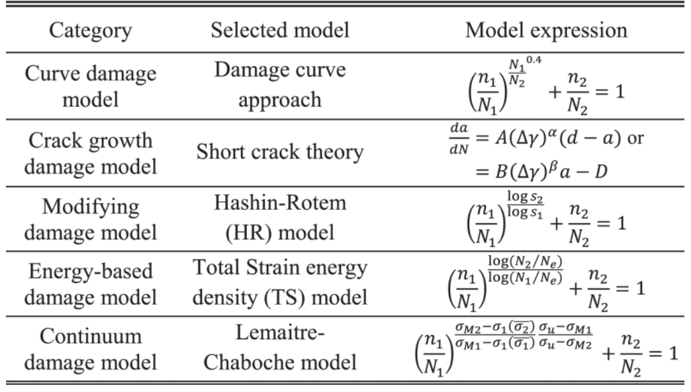

본 연구에서는 Hashin-Rotem(HR) 모델과 총 변형 에너지 밀도 모델(total strain energy density model, TS model)이 minor의 법칙을 대체하였다.

## Definition of State-of-Damage in CDMs
CDM은 특정 부하 단계의에서의 실패를 설명하기 위해 개발되었다. 이를 PHM에 적용하기 위해서는 SoD(State-of-Damage)의 개념을 정립해야한다. SoD는 일련의 스트레스틑 받을 때 실패할 때까지 재료 내에서 0에서 1로 축적되는 개념적 메트릭이며 재료의 health state를 평가하고 RUL을 계산하는 데 중요한 역할을 한다.

  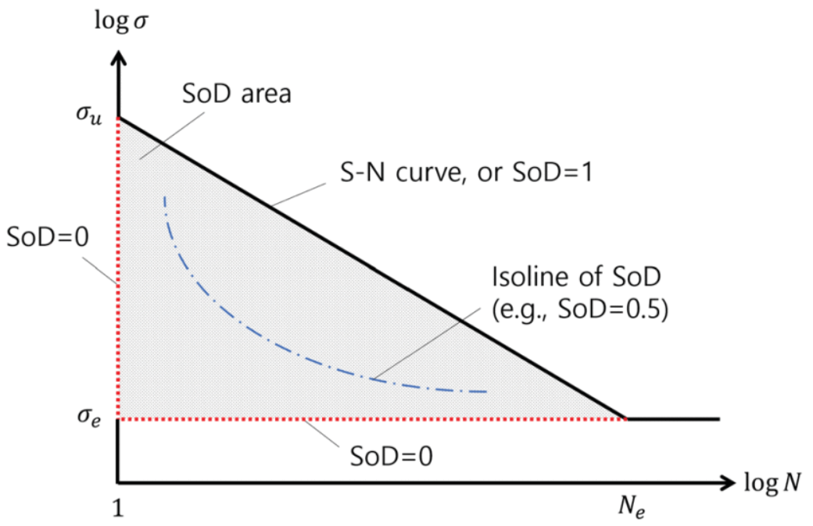

위 그림은 SoD를 수학적으로 정의하는 한 방법이며, SoD 정의의 개념적 표현은 로그 스케일의 S-N 곡선에 제시된다. SoD는 0과 1로 둘러싸인 삼각형 영역으로 SoD를 정의하는 프레임워크 역할을 할 수 있다.

* State-of-Damage in Miner's Rule 
마이너의 법칙의 ${SoD}_M$ 이 한 단계에 이르면 아래와 같이 정의될 수 있다.
$${SoD}_M = m_k/N_k$$
이는 재료가 수명 종료 또는 고장 지점에 도달하기에 충분한 손상(damage)가 있었음을 의미한다.
여기에 $m_k$ 가 누적되면 아래와 같이 된다.
$$m_1 = n_1 \space when \space k = 1,$$

$$m_k = n_k + m_{k-1\text{@}k},\space when \space k\ne 1.$$

여기서, $m_{k-1\text{@}k}는 하중 단계 $k$ 에서 $m_{k-1}과 동일함으로 수식을 다음과 같이 정의된다.

$$m_{k-1\text{@}k}=\frac {N_{k}}{N_{k-1}}m_{k-1}$$

기존 마이너의 법칙과 소개된 $m_k$로 설명하는 식은 로그 스케일에서 선형 관계를 갖고 있다고 할 수 있다:
$$\frac {\log m_{k-1\text{@}k} {-} \log m_{k-1}}{\log \sigma _{k}-\log \sigma _{k-1}}=\frac {\log N_{k}-\log N_{k-1}}{\log \sigma _{k}-\log \sigma _{k-1}}$$

  

이 관계는 로그-로그 스케일에서 S-N 곡선에 평행한 손상 상태의 진행을 암시합니다. 연구는 일련의 스트레스 단계(${\sigma}_1, {\sigma}_2, {\sigma}_3, {\sigma}_4$) 각각 0.4, 0.6, 0.8, 1.0의 배율로 손상 상태의 성장을 관찰하였으며, Miner's Rule에 따라 등고선과 손상 상태의 성장을 시각화했다.

또한 본 논문에서 이러한 방법을 통해 4개의 CDM에 대해 SoD로 정의하였다.

  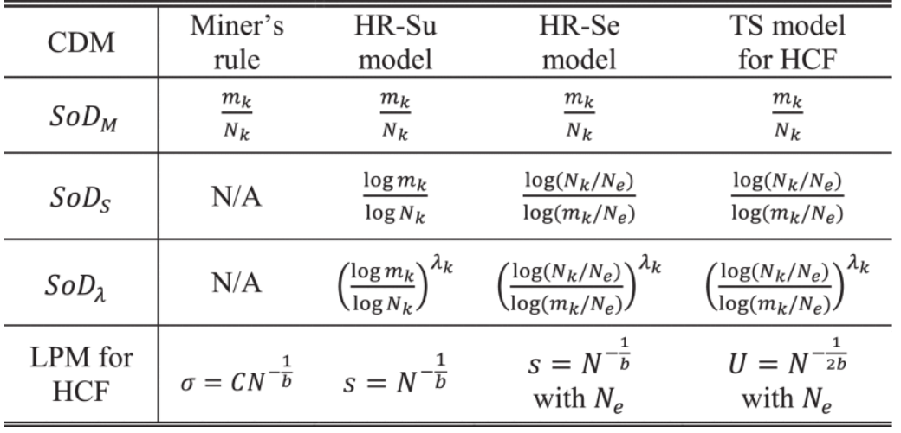

## Definition of Life Preditction Model for CDM
가변 하중에서 응력의 각 적용 단계에서 SoD를 계산하려면 LPM이 필요하여 본 놈눈에서는 분석의 목적으로 문제가 HCF(High Cycle Fatigue) 조건 하에 있다고 간주하고 다음과 같이 LPM에 대한 S-N 곡선을 사용했다.
$$\sigma =CN^{-\frac {1}{b}}$$

또한, HR-Su와 HR-Se의 손상 모델을 참고하고 CDM의 적용 가능성을 넓히기 위해 TS 모델을 참고한 사이클 당 총 변형 에너지 밀도로 LPM은 $U=N^{-\frac {2}{b}}$ 로 정의 될 수 있다.

## Experimental Validation of CDMs and SoDs for PHM
일반적으로 PCB(Printed Circuit Board)에 납떔된 전자 회로 기판은 전자 시스템의 필수적인 요소이다. 납땜은 열 또는 진동 환경에 노출될 때 보드에서 중요한 마모 메커니즘(Fatigue Mechanism)으로 인식된다. 또한 차량의 경우 많은 이동상태의 작동할 것임으로 결과적으로 납땜 부분의 열 및 진동 스트레스 환경에 노출되게 되어 이러한 전자제품의 PHM에 대한 CDM의 적용이 필요하다.

1. Experimental 
실험은 아래와 같은 전자부품, BGA(Ball Grid Array) 패키지가 선택되었다.

  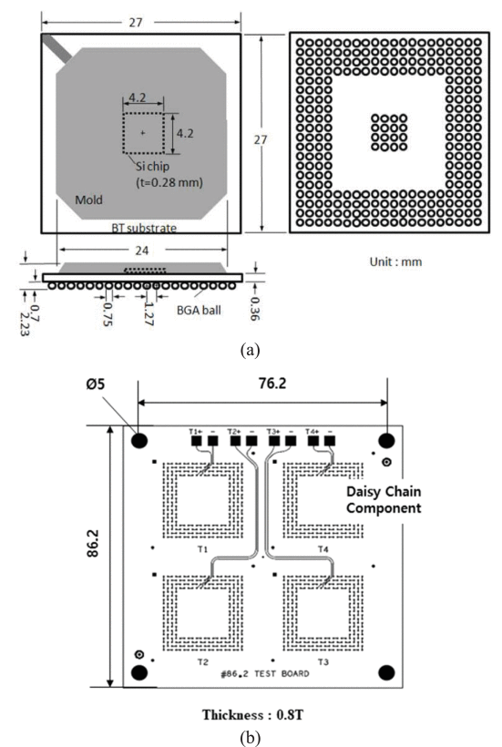
  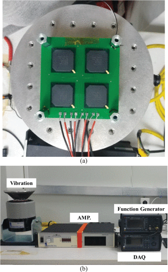

진동 테스트를 수행하기 전에, 테스트 보드의 자연 주파수는 아래 그림과 같이 273Hz 등과 같은 주파수로 기록되었다.

  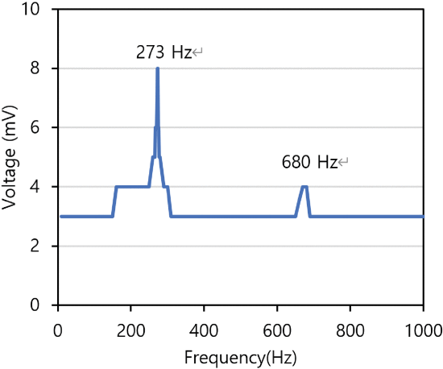

진동 테스트의 강도는 헬리콥터 조종사가 상하 방향으로 경험한 진동 연구를 기반으로 하였으며 진동 강도 범위는 0.1~ 0.7g의 범위를 가진다.
진동 시간의 지속시간은 1년 동안 헬리콥터 운영 일정에 따라 결정되었다.

  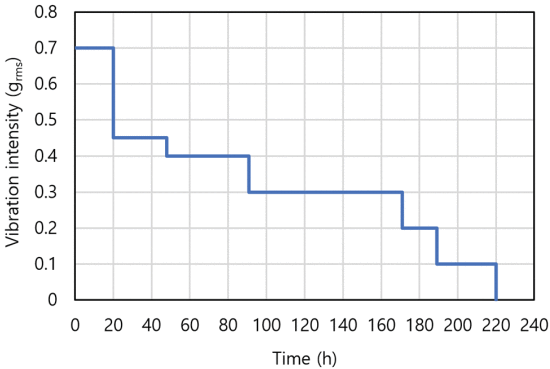

진동 테스트는 두 개의 전자 회로 기판에서 주행되었으며, 그 결과 각각 345시간, 313시간에 고장이 발생하였으며 보드의 평균 수명은 329 시간으로 계산되었다.

  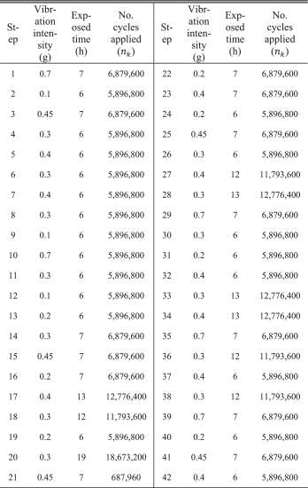

## Result
본 논문은 이외에 2가지 조건의 실험을 반복하여 SoD 추정을 위한 가변 로딩 조건 처리를 위한 PHM 프레임워크를 제안했다. PHM 프레임 워크에 SoD 실시간 진단 정보 또는 시스템의 현재 저하 정도가 통합되면 RUL을 추정할 수 있다. 

  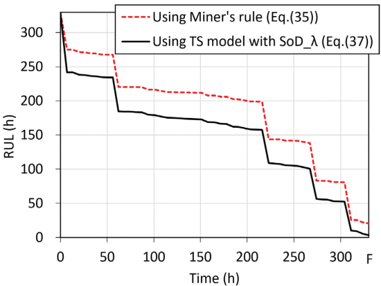

  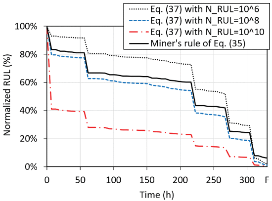

고장 및 실패 시점으로 예측된 RUL은 마이너의 법칙 그리고 TS 모델은 각각 20.5시간과 3.2시간이다. 위 값은 총 수명의 6.2%와 1%에 해당하며 위 분석은 SoD를 통합한 TS 모델이 마이너의 법칙보다 더 정확하게 RUL을 예측한다는 것을 보여준다.

## Conclusion
본 논문은 가변 진동 부하 조건의 솔더 조인트의 신뢰성에 집중한 CDM을 이용한 전자제품의 PHM을 수행하였다. 마이너의 법칙의 한계를 설명하기 위해 TS모델을 포함한 다양한 CDM을 제안하였고, SoD 또한 PHM 평가 방법으로 제안하였다. 또한 scale factor를 통합한 새로운 SoD 정의를 도입하여, PHM 맥락에서 선형성과 기하급수적으로 보이는 양상에서 trade를 제공하며 결과적으로 scale factor를 통합한 TS 모델이 SoD와 RUL을 정확하게 예측하는데 있어 기존의 방식을 능가하는 것을 검증했다.

## Review & Next Step
전자제품, 전장품(electronics)의 PHM의 방법론에 대해서 실증적으로 알아볼 수 있었던 논문이다. 또한 최근 머신러닝 기반의 방법론들이 쏟아지는 시대에서 실증적으로 문제를 접근하는 방식의 논문은 대단히 가치가 있다고 생각된다. 최근데 읽은 논문(머신러닝 방법론)들과 달리 이러한 논문을 읽고 이해하는데 오랜시간이 걸렸고 또한, 수많은 수식과 정의 및 배경을 어느 레벨에서부터 설명하고 위 논문이 이야기 하고자 하는 contribution(항상 대학원생이라면 중요하고, 강조하는)을 일목요연하게 설명하는데 어려움이 있었다. 다음 리뷰할 논문 역시 머신러닝의 특성인자 추출에 대한 논문이지만 이러한 논문들도 많은 경험을 쌓아 insight를 얻고, 제공해줄 수 있도록 논문을 꾸준히 깊게 읽고 리뷰할 것이다.

### 참고문헌
[1] [S. Lee, S. Park and C. Han, "Prognostics and Health Management Using Nonlinear Cumulative Damage Model for Electronic Devices Under Variable Loading," in IEEE Access, vol. 12, pp. 3356-3371, 2024, doi: 10.1109/ACCESS.2023.3347780.](https://ieeexplore.ieee.org/document/10375484)

[2] [N. M. Vichare and M. G. Pecht, "Prognostics and health management of electronics", IEEE Trans. Compon. Packag. Technol., vol. 29, no. 1, pp. 222-229, Mar. 2006.](https://ieeexplore.ieee.org/abstract/document/1599514)

[3] [Pecht, M. (2009). Prognostics and health management of electronics. Encyclopedia of structural health monitoring.](https://onlinelibrary.wiley.com/doi/full/10.1002/9780470061626.shm118)