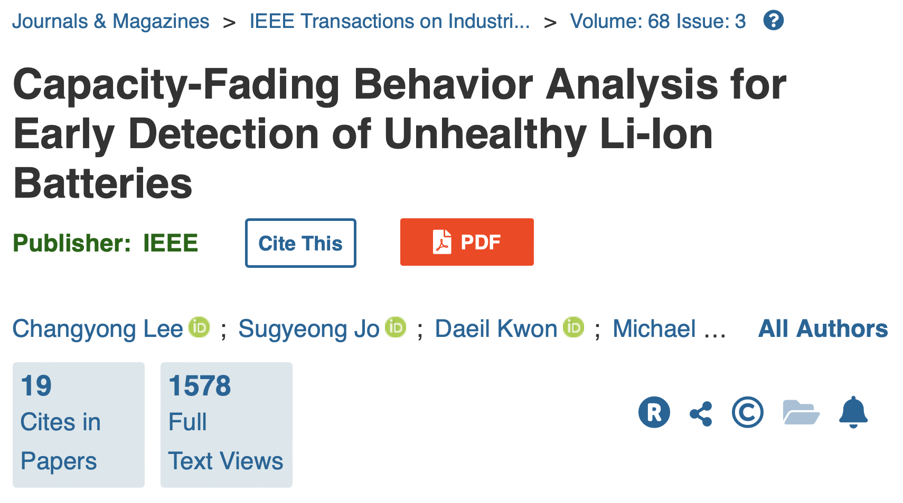
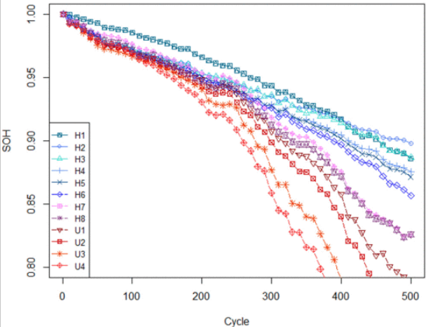

# Title: Capacity-Fading Behavior Analysis for Early Detection of Unhealthy Li-ion Batteries 

## Abstract
LIB(Lithum-ion Battery)에 대한 신뢰성 테스트는 휴대용 전자 제품을 개발하기 위한 운영 백엔드 전략을 설계하는 데 매우 중요하다.
본 논문의 저자는 리튬이온 배터리의 신뢰성 시험 중 조기 고장 징후 발견을 위한 리튬이온 배터리 용량 저하 양상을 분석했다.
개발된 접근 방법은 특정 주기에서 배터리의 용량 감소의 이상 스코어(anomaly score)를 측정하기 위한 로컬 이상치를 이용하였고, 주기에 걸친 이상 스코어를 정규화 하기 위한 커널 밀도 추정, 특정 상태에 있을 확률을 추정하기 위해 은닉 마르코프 모델(Hidden Markov Model, HMM)을 이용하였다.
실험 결과는 이전의 개발된 방법보다 신뢰성 개발을 위한 배터리의 주기를 한 달 미만인 100 사이클로 줄일 수 있다고 나타냈다.

## Introduction
리튬 이온 배터리의 대한 자격 테스트는 반복적인 충반정 단계가 필요하며, 배터리의 신뢰성을 평가하는데 몇 달이 걸린다. 리튬 이온 배터리의 신뢰성 테스트는 배터리 용량의 변화를 식별하기 위한 일련의 충전 및 방전 단계로 구성되며 개별 충전 및 방전은 c-rate, 충방전 속도, 공칭 용량과 같은  실험 매개변수를 조정하여 빠르게 처리할 수 있지만, 일반 사용 조건의 매개변수로 배터리의 남은 유효 수명을 모델링 하기 위해서는 오랜 시간(최소 약 3개월)이 걸린다.
따라서 전자(electronics) 산업에서 비즈니스 결정을 내리는데 배터리 신뢰성 시험의 시간을 주요한 병목 지점이다.

이전 접근 방식으로 SOH(State Of Health) 추정을 위한 곡선 피팅(curve fitting) 기반의 모델링, 모델 매개변수 추정을 위한 칼만 필터(Kalman filter), 비선형 용량 페이드 모델을 구축하기 위해 이용된 확장된 칼만 필터 및 남은 유효 수명(Remaining Useful Life, RUL) 추정을 위한 파티클 필터(Particle filter)를 이용하여 리튬이온 배터리의 용량 감소 추세를 분석했다.

이전 접근 방식들은 리튬 이온 배터리의 전체 용량 페이드 추세를 관찰하는데 매우 유용하였다. 그러나, 위 접근 방식들은 용량 저하와 관련하여 규정된 용량 감소와 같은 비현실적인 가정을 기반으로 하며, 배터리 용량 저하 양상은 전해질 구성요소, 부하 조건 및 충방전시의 전압 차단과 같은 각기 다른 동적흐름을 가지기 때문에 이러한 점을 고려해야한다. 또한, 위 방식들은 배터리 신뢰성 테스트의 초기 단계, 즉 리튬이온 배터리의 용량이 가속되는 변곡점이 관찰되지 않았을 때 결정적으로 잘 작동하지 않을 수 있다.

이러한 문제를 해결하기 위헤 본 논문에서는 신뢰성 테스트 중 리튬 이온 배터리의 저하를 조기에 발견할 수 있는 용량 감소 행동(Capacity-fading behavior analysis)을 분석했다.

## Methodology
1. Local Outlier Factor(지역 이상치 요인) 
본 논문에서 제안하는 접근 방식은 밀도 시반 이상 감지 방법을 기반으로 객체의 이상 점수(anormaly score)는 주변 물체의 평균 밀도와 그 자체의 지역 밀도의 비율으로 측정된다.
밀도 기반 이상 감지 방법은 아래와 같은 이유로 리튬이온 배터리의 용량 감소 동작의 이상을 검사하기 위해 통계 및 거리 기반 방법보다 선호된다. 
* 리튬 이온 배터리의 용량 감소 동작 분포에 대한 이론적 이해의 부족.
리튬이온 배터리의 용량 감소에 대한 분포는 또한 새로운 배터리에 대한 용량 감소를 식별하기 어려우며, 밀도 기반 이상 감지 방법은 분포에 대한 가정이 필요하지 않아 통계적 방법보다 선호된다.
* 리튬이온 배터리의 용량 감소 동작을 각 배터리 마다 다른 양상을 가진다.
그러나 밀도 기반 이상 감지 방법은 일관성 없는 데이터 패턴에서 이상을 식별할 수 있기 때문에 거리 기반 방법을 능가한다.

앞서 언급되었듯이, 리튬 이온 배터리의 용량 감소 동작은 개별 배터리에 따라 비선형적이고 다른 양상을 보인다. 따라서 리튬 이온 배터리의 용량 감소 행동은 두 가지 요인으로 특성화 할 수 있다.

$$Retention\ Rate = RR(t) = \frac{C(t)}{C(0)},  C(t): t 사이클에서의 배터리 용량$$ 
$$Fade\ Rate = FR(t) = \frac{RR(t)- RR(t-1)}{RR(t-1)}$$

용량의 유지율(retention rate, RR) 그리고 RR의 상대적 변화 척도인 감소율(fade rate, FR)으로 리튬이온 배터리의 용량 감소 동작의 다양한 형태와 모양을 모델링 하는 데 사용할 수 있다.

정의된 두 가지 요인(RR, FR)으로 LOF를 통해 계산될 수 있다.

계산 절차를 간단히 요약하자면,
1단계: 테스트 배터리(p_i)에 대한 사이클(t=1)의 유클리드 거리를 계산하여 정상상태의 배터리 집합(Set of Healthy Batteries, SHBs) 내의 k번째 가까운 이웃 배터리와의 거리를 계산한다.
2단계: SHBs에 있는 각 배터리 q에 대해, $p_1$까지의 도달거리(reachDist($p_i, q))를 계산한다.
3단계: 지역 도달 가능 밀도인(Local Reach Distance,LRD)를 계산한다.
4단계: p_i의 이상치 점수인 LOF(p_i)를 계산함
5단계: 사이클 인덱스를 1증가시켜 1~4단계를 마지막 테스트 배터리 p_n까지 반복한다.

만약 테스트 베터리의 용량 감소 동작이 SHBs의 동작과 유사하다면, 이상 점수는 1점에 접근하며, 그렇지 않으면 테스트 배터리의 용량 감소 동작이 SHB의 동작과 다르기 때문에 이상 점수가 계속 증가한다. 그러므로, 그것의 밀도는 정상적인 패턴보다 낮다.

2. Kernel Density Estimation(커널 밀도 추정, KDE) 

LOF는 특정 주기에서 테스트 베터리의 용량 감소 동작의 이상 점수를 측정하지만, 다른 데이터 세트를 사용하기 때문에 주기 간의 이상 점수를 비교할 수는 없다. 따라서 본 논문의 저자는 전체 주기에 걸쳐있는 이상 점수의 범위를 정규회하기 위해 커널 밀도 추정을 이용했다.
KDE는 이산 샘플에서 연속 확률 밀도 함수를 결정하는데 사용되는 비 모수적 방법이며, 특히 이 방법은 각 생픔에 대한 커널 함수를 구성한 후 모든 커널을 축적하여 변수의 확률 밀도 함수를 추정한다.

>kernel: 각 데이터 포인트 주변에 위치하며, 데이터 포인트의 영향을 부드럽게 만드는 함수를 의미함. 대표적인 커널 함수로는 정규 분포(가우시안) 커널이 있으며 모든 곳에서 연속이고 미분 가능하여, 데이터 포인트에서 멀어질수록 값이 0에 가깝도록 만드는 특성이 있다.

3. Hidden Markov Model(은닉 마르코프 모델, HMM)
HMM은 기계학습 기술으로 두 배의 확률 과정을 기반으로 하며 기본 확률 과정을 직접 관찰할 수 없지만, 두 번째 확률 프로세스를 관측할 수 있을 때 사용한다. 리튬이온 배터리의 용량 감소 동작에서 다른 주기에 걸쳐있는 테스트 배터리의 상태의 전환 확률 매트릭스와 관찰 확률 밀도 매트릭스 및 초기 상태 확률 벡터로 테스트 배터리의 건강 상태를 두 가지 범주(Healthy/ Unhealthy)로 분류 할 수 있다.

## Experimental Setting
1. Capacity Fade Data
본 논문에서 수행한 실험에 사용된 데이터는 휴대용 가전제품용 12개의 리튬이온 배터리의 용량 저하 데이터가 연구의 초기 데이터 세트로 사용되었다.
초기 데이터 세트는 8가지의 건강한 데이터 세트와 4가지의 건강하지 않은 데이터 세트로 구성되어 있다. 배터리 용량은 최대 500 사이클까지 측정되었으며, 이는 가속된 스트레스 조건에서 약 3개월, 정상적인 사용 조건에서 약 2년에 해당된다. SOH가 500 사이클 전에 초기 값의 80% 이하로 떨어지면 배터리는 고장(U)으로 간주되며, 그렇지 않으면 정상(H)으로 간주된다.

고장상태의 리튬이온 배터리의 샘플을 얻기 어렵기 때문에 본 논문에서는 각 대상 클래스와 가장 가까운 이웃에 대한 특징 공간을 이용하여 합성 소수 오버샘플링을 수행했다. 우선 초기 데이터 세트에서 무작위로 선택된 관측치로부터 총 100건의 정상 상태의 샘플을 획득하였고, 초기 12개 관측치를 포함하여 총 70개의 정상상태의 관측치와 30개의 고장 상태의 샘플을 획득하였다.

2. Hyper-parameter
모델의 파라미터는 데이터 세트의 특성을 고려하여 조심스럽게 접근해야하며, 첫 째로 LOF와 관련하여 k 값은 Breunig et al.에 따라 통계적 변동을 제거하기 위해 10으로 설정되었다.
두 번째로, KDE에 관하여 Silverman을 따라 가우시안 커널 함수를 사용하였고 커널의 평활화 요소들 아래와 같이 설정하였다.
$$h=({\frac{4\sigma{hat}^5}{3n}}^{\frac{1/5}}) = 1.06{\sigma}n^-(\frac{1}{5})$$

##  Results

