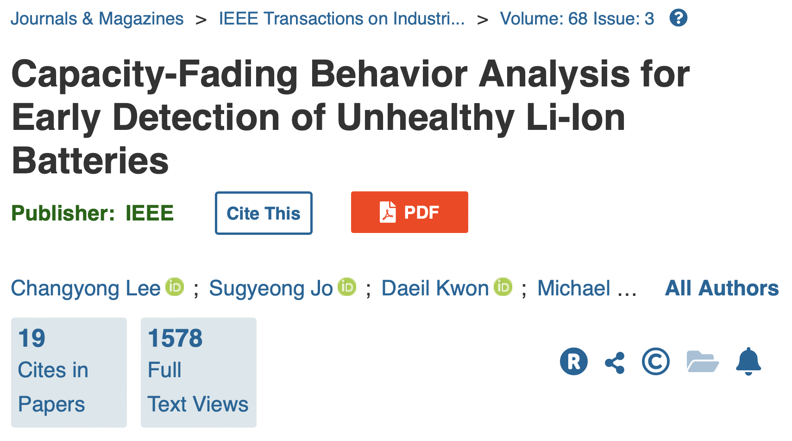

# Title: Capacity-Fading Behavior Analysis for Early Detection of Unhealthy Li-ion Batteries 

## Abstract
LIB(Lithum-ion Battery)에 대한 신뢰성 테스트는 휴대용 전자 제품을 개발하기 위한 운영 백엔드 전략을 설계하는 데 매우 중요하다.
본 논문의 저자는 리튬이온 배터리의 신뢰성 시험 중 조기 고장 징후 발견을 위한 리튬이온 배터리 용량 저하 양상을 분석했다.
개발된 접근 방법은 특정 주기에서 배터리의 용량 감소의 이상 스코어(anomaly score)를 측정하기 위한 로컬 이상치를 이용하였고, 주기에 걸친 이상 스코어를 정규화 하기 위한 커널 밀도 추정, 특정 상태에 있을 확률을 추정하기 위해 은닉 마르코프 모델(Hidden Markov Model, HMM)을 이용하였다.
실험 결과는 이전의 개발된 방법보다 신뢰성 개발을 위한 배터리의 주기를 한 달 미만인 100 사이클로 줄일 수 있다고 나타냈다.

## Introduction
리튬 이온 배터리의 대한 자격 테스트는 반복적인 충반정 단계가 필요하며, 배터리의 신뢰성을 평가하는데 몇 달이 걸린다. 리튬 이온 배터리의 신뢰성 테스트는 배터리 용량의 변화를 식별하기 위한 일련의 충전 및 방전 단계로 구성되며 개별 충전 및 방전은 c-rate, 충방전 속도, 공칭 용량과 같은  실험 매개변수를 조정하여 빠르게 처리할 수 있지만, 일반 사용 조건의 매개변수로 배터리의 남은 유효 수명을 모델링 하기 위해서는 오랜 시간(최소 약 3개월)이 걸린다.
따라서 전자(electronics) 산업에서 비즈니스 결정을 내리는데 배터리 신뢰성 시험의 시간을 주요한 병목 지점이다.

이전 접근 방식으로 SOH(State Of Health) 추정을 위한 곡선 피팅(curve fitting) 기반의 모델링, 모델 매개변수 추정을 위한 칼만 필터(Kalman filter), 비선형 용량 페이드 모델을 구축하기 위해 이용된 확장된 칼만 필터 및 남은 유효 수명(Remaining Useful Life, RUL) 추정을 위한 파티클 필터(Particle filter)를 이용하여 리튬이온 배터리의 용량 감소 추세를 분석했다.

이전 접근 방식들은 리튬 이온 배터리의 전체 용량 페이드 추세를 관찰하는데 매우 유용하였다. 그러나, 위 접근 방식들은 용량 저하와 관련하여 규정된 용량 감소와 같은 비현실적인 가정을 기반으로 하며, 배터리 용량 저하 양상은 전해질 구성요소, 부하 조건 및 충방전시의 전압 차단과 같은 각기 다른 동적흐름을 가지기 때문에 이러한 점을 고려해야한다. 또한, 위 방식들은 배터리 신뢰성 테스트의 초기 단계, 즉 리튬이온 배터리의 용량이 가속되는 변곡점이 관찰되지 않았을 때 결정적으로 잘 작동하지 않을 수 있다.

이러한 문제를 해결하기 위헤 본 논문에서는 신뢰성 테스트 중 리튬 이온 배터리의 저하를 조기에 발견할 수 있는 용량 감소 행동(Capacity-fading behavior analysis)을 분석했다.

## Methodology
* Local Outlier Factor(지역 이상치 요인) 
본 논문에서 제안하는 접근 방식은 밀도 시반 이상 감지 방법을 기반으로 객체의 이상 점수(anormaly score)는 주변 물체의 평균 밀도와 그 자체의 지역 밀도의 비율으로 측정된다.
밀도 기반 이상 감지 방법은 아래와 같은 이유로 리튬이온 배터리의 용량 감소 동작의 이상을 검사하기 위해 통계 및 거리 기반 방법보다 선호된다. 
1. 리튬 이온 배터리의 용량 감소 동작 분포에 대한 이론적 이해의 부족.
리튬이온 배터리의 용량 감소에 대한 분포는 또한 새로운 배터리에 대한 용량 감소를 식별하기 어려우며, 밀도 기반 이상 감지 방법은 분포에 대한 가정이 필요하지 않아 통계적 방법보다 선호된다.
2. 리튬이온 배터리의 용량 감소 동작을 각 배터리 마다 다른 양상을 가진다.
그러나 밀도 기반 이상 감지 방법은 일관성 없는 데이터 패턴에서 이상을 식별할 수 있기 때문에 거리 기반 방법을 능가한다.

앞서 언급되었듯이, 리튬 이온 배터리의 용량 감소 동작은 개별 배터리에 따라 비선형적이고 다른 양상을 보인다. 따라서 리튬 이온 배터리의 용량 감소 행동은 두 가지 요인으로 특성화 할 수 있다.

$$Retention Rate = RR(t) = \frac{C(t)}{C(0)},  C(t): t 사이클에서의 배터리 용량$$ 

$$Fade Rate = FR(t) = \frac{RR(t)- RR(t-1)}{RR(t-1)}$$

